<div align="center">


<br/>


<br/><br/>

> *"A GitHub Action runs every night. A new fact appears every morning. You do nothing."*

<br/>

</div>

---

## ◈ What This Is

A fully automated **random fact card** that lives on your GitHub profile. Every day at midnight UTC a GitHub Action wakes up, eeks out a random fact from the bunch, generates a styled SVG card in terminal silver and acid yellow on void black, and commits it back silently. Your profile README embeds it as a raw image URL. The card updates itself. You never touch it again.

---

## ◈ How It Works

```
   GitHub Actions  (midnight UTC, every day)
        │
        ▼
   app/services.py    →   fetches a random fact
                        falls back to fully random if facts.json is unreachable
        │
        ▼
   app/utils.py       →   wraps text, calculates height, escapes XML
        │
        ▼
   app/main.py        →   assembles and renders the SVG card
        │
        ▼
   fact.svg           →   committed back to the repo automatically
        │
        ▼
   profile README     →   embeds via raw GitHub URL — always fresh
```

---

## ◈ The Card



---

## ◈ Embed It

```md

```

Drop that into any README. The card auto-updates every 24 hours.

---

## ◈ Structure

```
trivia-pulse/
│
├── app/
│   ├── main.py          ←  SVG assembly and entry point
│   ├── utils.py         ←  text wrapping, height calc, XML escaping
│   └── services.py      ←  fact fetch with fallback to random
│
├── .github/
│   └── workflows/
│       └── update.yml   ←  daily cron GitHub Action
│
├── fact.svg             ←  auto-generated — do not edit manually
├── facts.json           ←  fallback facts — reduces API dependency
└── README.md
```

---

## ◈ Run Locally

```bash
git clone https://github.com/MuhammadAhmadHamim/trivia-pulse
python app/main.py
```

---

## ◈ The Palette

<div align="center">

| Token | Hex | Role |
|:---:|:---:|:---|
| **Void Black** | `#0a0a0a` | Card background |
| **Terminal White** | `#e8e8e8` | Primary text and borders |
| **Dim Silver** | `#a0a0a0` | Secondary text and accents |
| **Acid Yellow** | `#e8ff00` | Fact body text |

</div>

---

## ◈ Skills This Project Demonstrates

<div align="center">


</div>

---

<div align="center">


</div>